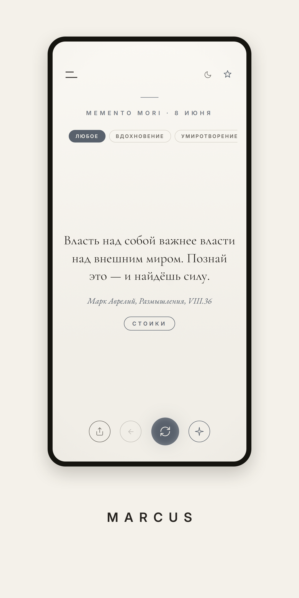
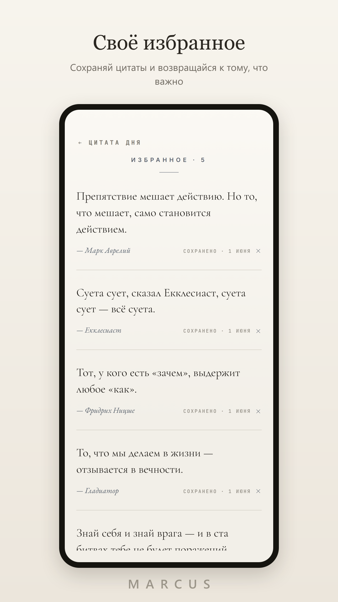
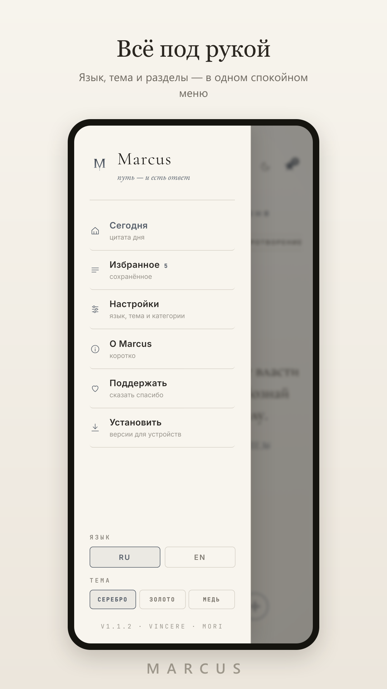
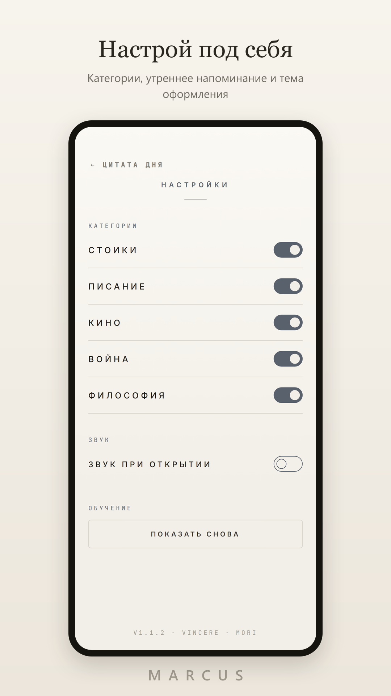
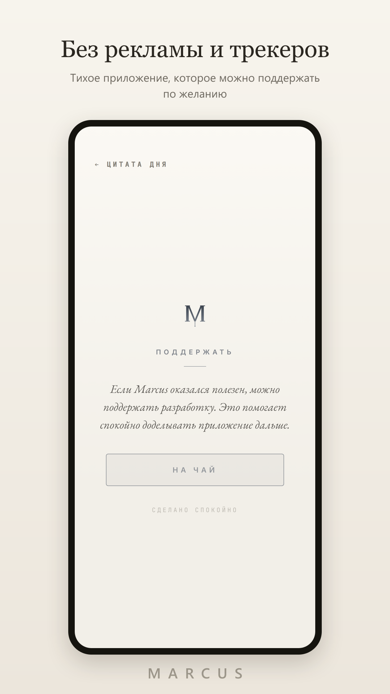

  

  <h1>Marcus</h1>

  
<strong>quiet daily quotes for desktop, mobile and web</strong>

  
<em>путь - и есть ответ</em>

  

    
    
  

  

    <a href="#english-version">English version</a>
  

  

  
  
  
  

## Скачать

| Платформа | Файл |
| --- | --- |
| Windows | [Setup .exe](https://github.com/vincere-mori/marcus/releases/latest/download/Marcus-Windows-x64-Setup.exe) / [MSI](https://github.com/vincere-mori/marcus/releases/latest/download/Marcus-Windows-x64.msi) |
| macOS | [DMG](https://github.com/vincere-mori/marcus/releases/latest/download/Marcus-macOS-universal.dmg) |
| Linux | [AppImage](https://github.com/vincere-mori/marcus/releases/latest/download/Marcus-Linux-x86_64.AppImage) / [DEB](https://github.com/vincere-mori/marcus/releases/latest/download/Marcus-Linux-amd64.deb) / [RPM](https://github.com/vincere-mori/marcus/releases/latest/download/Marcus-Linux-x86_64.rpm) |
| Android | [APK](https://github.com/vincere-mori/marcus/releases/latest/download/Marcus-Android.apk) |

В браузере: [vincere-mori.github.io/marcus](https://vincere-mori.github.io/marcus/)

## Что это

Marcus - приложение с одной мыслью на день. Без ленты, аккаунтов и уведомлений ради уведомлений. Открыл, прочитал, сохранил нужное, пошел дальше.

Внутри - стоики, философия, кино, военные заметки и короткие фразы, к которым хочется вернуться.

## Почему удобно

- работает как PWA в браузере
- есть desktop сборки для Windows, macOS и Linux
- есть Android APK
- избранное хранит важные цитаты под рукой
- темы и категории не мешают главному экрану
- после первого запуска можно пользоваться офлайн

## English version

Marcus is a quiet daily quote app for people who want one short thought instead of another noisy feed.

It brings together stoicism, philosophy, cinema, military notes and short lines worth returning to. Open it, read one quote, save what matters and move on.

## Download

| Platform | Build |
| --- | --- |
| Windows | [Setup .exe](https://github.com/vincere-mori/marcus/releases/latest/download/Marcus-Windows-x64-Setup.exe) / [MSI](https://github.com/vincere-mori/marcus/releases/latest/download/Marcus-Windows-x64.msi) |
| macOS | [DMG](https://github.com/vincere-mori/marcus/releases/latest/download/Marcus-macOS-universal.dmg) |
| Linux | [AppImage](https://github.com/vincere-mori/marcus/releases/latest/download/Marcus-Linux-x86_64.AppImage) / [DEB](https://github.com/vincere-mori/marcus/releases/latest/download/Marcus-Linux-amd64.deb) / [RPM](https://github.com/vincere-mori/marcus/releases/latest/download/Marcus-Linux-x86_64.rpm) |
| Android | [APK](https://github.com/vincere-mori/marcus/releases/latest/download/Marcus-Android.apk) |

Web app: [vincere-mori.github.io/marcus](https://vincere-mori.github.io/marcus/)

## Features

- daily quote
- random next quote
- favorites
- visual themes
- quote categories
- Russian and English interface
- offline mode after the first launch

## Links

- [Releases](https://github.com/vincere-mori/marcus/releases/latest)
- [Repository](https://github.com/vincere-mori/marcus)
- [Author](https://github.com/vincere-mori)
