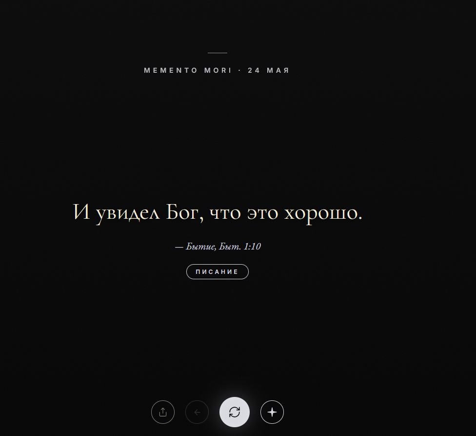
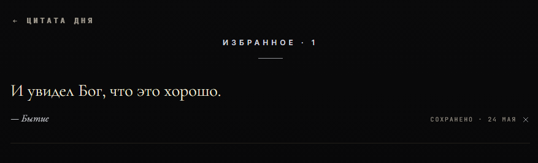
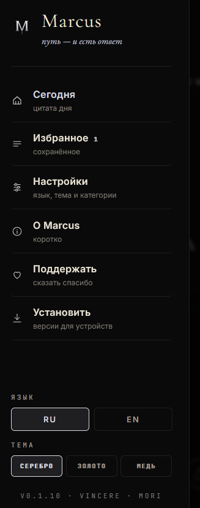

  

  <h1>Marcus</h1>

  
<strong>quiet daily quotes for desktop, mobile and web</strong>

  
<em>путь - и есть ответ</em>

  

    
    
  

  
  

## Скачать

| Платформа | Файл |
| --- | --- |
| Windows | [Setup .exe](https://github.com/vincere-mori/marcus/releases/download/v0.1.10/Marcus_0.1.10_x64-setup.exe) / [MSI](https://github.com/vincere-mori/marcus/releases/download/v0.1.10/Marcus_0.1.10_x64_en-US.msi) |
| macOS | [DMG](https://github.com/vincere-mori/marcus/releases/download/v0.1.10/Marcus_0.1.10_universal.dmg) |
| Linux | [AppImage](https://github.com/vincere-mori/marcus/releases/download/v0.1.10/Marcus_0.1.10_amd64.AppImage) / [DEB](https://github.com/vincere-mori/marcus/releases/download/v0.1.10/Marcus_0.1.10_amd64.deb) / [RPM](https://github.com/vincere-mori/marcus/releases/download/v0.1.10/Marcus-0.1.10-1.x86_64.rpm) |
| Android | [APK](https://github.com/vincere-mori/marcus/releases/download/v0.1.10/Marcus-v0.1.10-android.apk) |

В браузере: [vincere-mori.github.io/marcus](https://vincere-mori.github.io/marcus/)

## Что это

Marcus - приложение с одной мыслью на день. Без ленты, аккаунтов и уведомлений ради уведомлений. Открыл, прочитал, сохранил нужное, пошел дальше.

Внутри - стоики, философия, кино, военные заметки и короткие фразы, к которым хочется вернуться.

## Почему удобно

- работает как PWA в браузере
- есть desktop сборки для Windows, macOS и Linux
- есть Android APK
- избранное хранит важные цитаты под рукой
- темы и категории не мешают главному экрану
- после первого запуска можно пользоваться офлайн

  

## English

Marcus is a quiet daily quote app. No feed, no ads, no account. Open it, read one line, save what matters and move on.

Use the [web app](https://vincere-mori.github.io/marcus/) or download the latest build from [Releases](https://github.com/vincere-mori/marcus/releases/latest).

## Links

- [Releases](https://github.com/vincere-mori/marcus/releases/latest)
- [Repository](https://github.com/vincere-mori/marcus)
- [Author](https://github.com/vincere-mori)
